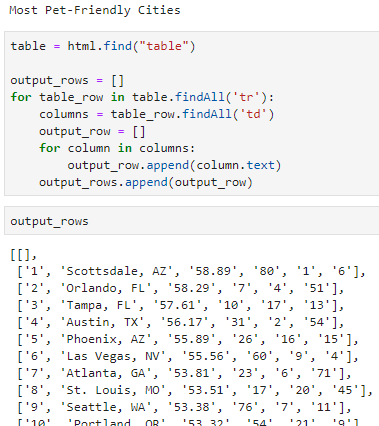
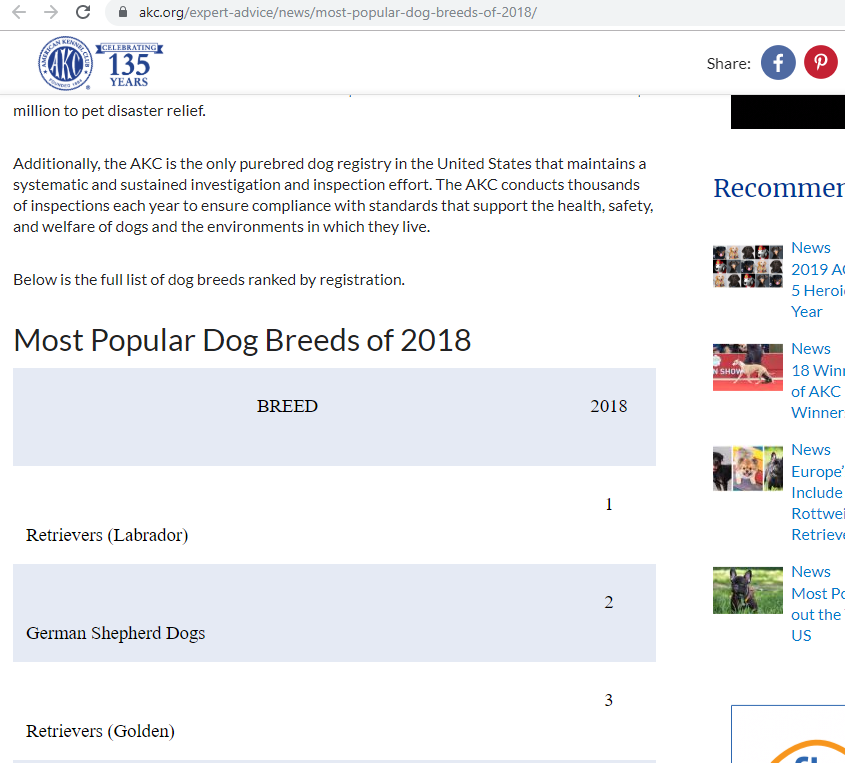
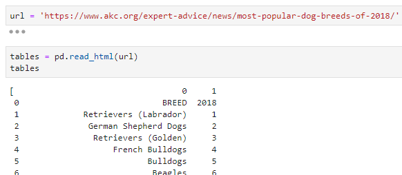
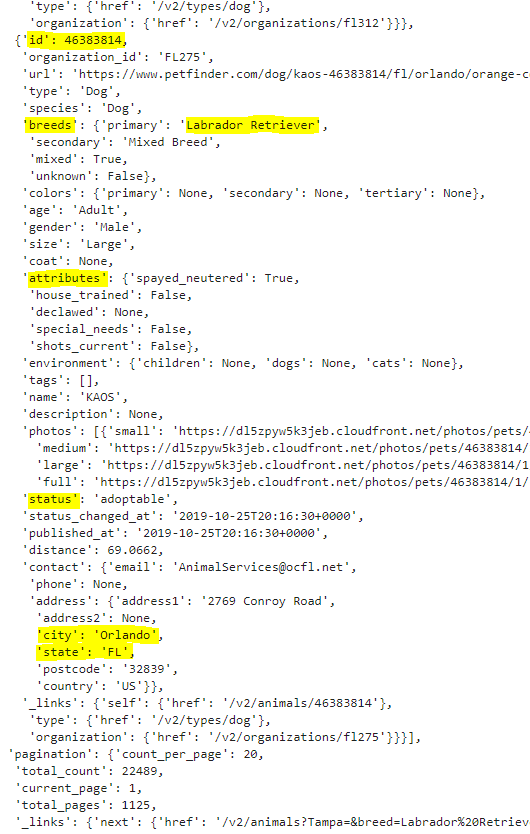
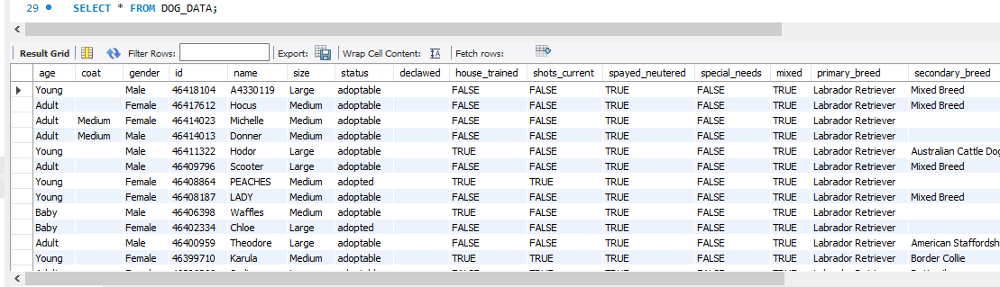
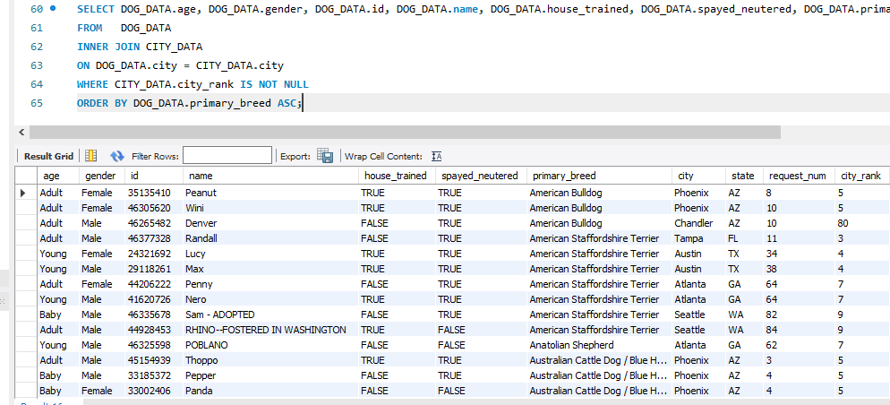

# Petfinder API ETL

Trying to find the perfect pet?\
petfinder.com lists thousands of pets on their website and allows you to search one location at a time and filter by pet type!  But what if you would like to be more specific in your search by including factors that are not default filters?  What if you would like to store a targeted subset of data to perform an analysis of pets across more than one location without manually altering each search?  
We set out to tackle these issues!  
By utilizing API interactions, Python, pandas, and Beautiful Soup, we were able to make automated requests and filter the results to find just the selection of data that we wanted.

# Getting Started / Prerequisites

Tools:\
Python3\
BeautifulSoup from bs4\
requests\
os\
pandas\
pymongo\
urlopen from urllib.request\
re\
numpy\
nltk\
sqlite3\
create_engine from sqlalchemy\
Plotly.js\
Flask\
\
Resources:\
https://www.petfinder.com/
https://wallethub.com/edu/most-pet-friendly-cities/5562/
https://www.akc.org/expert-advice/news/most-popular-dog-breeds-of-2018/

# Authors

* Daniel Mihok
* Farah Clerveau

# Setting Parameters

petfinder.com lists many types of pets across many geographic areas, but we decided to focus on popular dog breeds in cities renowned for their "pet-friendliness."  
To obtain values for the parameters of "US Pet Friendly Cities" and "Most Popular Dog Breeds", we turned to the publicly available results of studies done by WalletHub and the American Kennel Club (AKC) which can be found at https://wallethub.com/edu/most-pet-friendly-cities/5562/ and https://www.akc.org/expert-advice/news/most-popular-dog-breeds-of-2018/, respectively.  
Rather than manually copying the lists of cities and breeds, we decided to use tools such as pandas, requests, Beautiful Soup, csv, and urllib.request to "web scrape" the data listed on these sites.  By copying the lists in this manner, the code for this project will be more easily scalable.  
Below, we can see how the Python libraries easily and quickly copied the table content from the sites into dataframes that we could use and/or save as database files.  

  

  

  

  

# API calls and JSON parsing (Extraction and Transformation)

petfinder.com offers an API which is available after receiving an API key.  The possibilities for gathering data in this manner are virtually without limit.  We used the previously scraped city and breed rankings to narrow our search.  Of the 100 ranked cities and 192 ranked dog breeds, we gathered search results for the top ten breeds in or near the top ten cities, with a limit of 50 results per breed per city.  Using our key, we sent requests to the Petfinder API and received our responses in JSON format.  As you can see from the image below, there were far more details included in a typical JSON response than we required.  

  

Using pandas and json_normalize, we parsed the responses to obtain useful information, including the highlighted elements, and discarded items that we would not need.  Note: see our More Info section for details regarding response elements that were discarded.  Some column names were changed to eliminate ambiguity and the "request_num" column was added to track which API request generated each row.

# Loading to a Database

After saving our transformed data to temporary files, we created a new schema in MySQL Workbench and utilized the import wizard to load our data into a permanent database location.  Our API response data, web-scraped city ranks, and dog breed ranks were all loaded as separate tables after we defined the table column data types.  With the new database created and populated, we were ready to view the data in its database location and query the database for specific results.  

Seen below, we have an image of the data and an example query to return data from all three tables where the city is ranked and this is sorted alphabetically by dog breed.  

  

  

We have now completed all three steps of the ETL process!  

Want to interact with this data without experience in SQL or MySQL Workbench?  No Problem!\
Click the link below to manipulate the data in a platform that does not require MySQL Workbench
(github.io deployed)