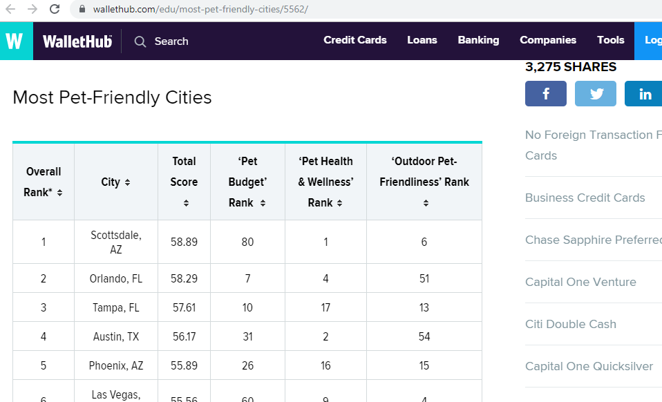

# Petfinder_API_ETL

Trying to find the perfect pet?\
petfinder.com lists thousands of pets on their website and allows you to search one location at a time and filter by pet type!  But what if you'd like to be more specific in your search by including factors that are not default filters?  What if you'd like to perform an analysis of pets across more than one location without repeating your search?  
We set out to tackle these issues!  
By utilizing API interactions, Python, pandas, and Beautiful Soup, we were able to filter the results to find just the selection of data that we wanted.

# Getting Started / Prerequisites

Tools:\
Python3\
BeautifulSoup from bs4\
requests\
os\
pandas\
pymongo\
urlopen from urllib.request\
re\
numpy\
nltk\
sqlite3\
create_engine from sqlalchemy\
Plotly.js\
Flask\
\
Sites (examples):\
https://www.petfinder.com/
https://wallethub.com/edu/most-pet-friendly-cities/5562/
https://www.akc.org/expert-advice/news/most-popular-dog-breeds-of-2018/

# Authors

* Daniel Mihok
* Farah Clerveau

# Setting Parameters

petfinder.com lists many types of pets across many geographic areas, but we decided to focus on popular dog breeds in cities renowned for their "pet-friendliness."  
To obtain values for the parameters of US_pet_friendly_cities and most_popular_dog_breeds, we turned to the publicly available results of studies done by WalletHub and the American Kennel Club (AKC) which can be found at https://wallethub.com/edu/most-pet-friendly-cities/5562/ and https://www.akc.org/expert-advice/news/most-popular-dog-breeds-of-2018/, respectively.  
Rather than manually copying the lists of cities and breeds, we decided to use tools such as pandas, requests, Beautiful Soup, csv, and urllib.request to "web scrape" the data listed on these sites.  By copying the lists in this manner, the code for this project will be more easily scalable.  
Below, we can see how the Python libraries easily and quickly copy the table content from the sites into dataframes that we can use and/or save as database files.  

  

  

  

  

# API calls and JSON parsing (Extraction and Transformation)

petfinder.com offers an API which is available after receiving an API key.  Using our key, we sent requests to the Petfinder API and received our responses in JSON format.  As you can see from the image below, there were far more details included in a typical JSON response than we required.\
We parsed the responses to obtain the highlighted elements and used pandas to place these into a dataframe.  